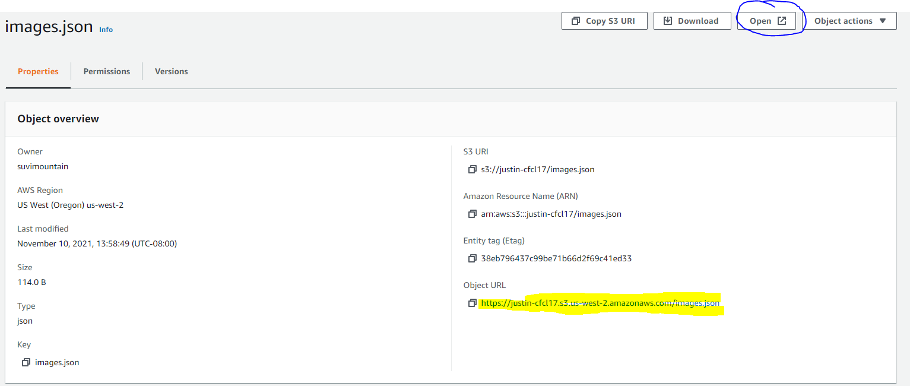
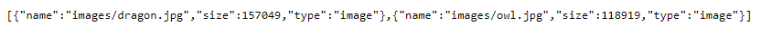

# image-lambda

lab17

Author: Justin Hamerly  

## Problem Domain  

User can upload an image to an s3 bucket.  This will trigger the lambda function.  

The lambda function will then check for an existing images.json file, and create one if it doesn't exist.

It will push the metadata for the image into the json file, and reupload it to the s3 bucket.

## Links  

[lambda code](./getImgJson.js)  
[s3 images.json](https://justin-cfcl17.s3.us-west-2.amazonaws.com/images.json)  

  
  
